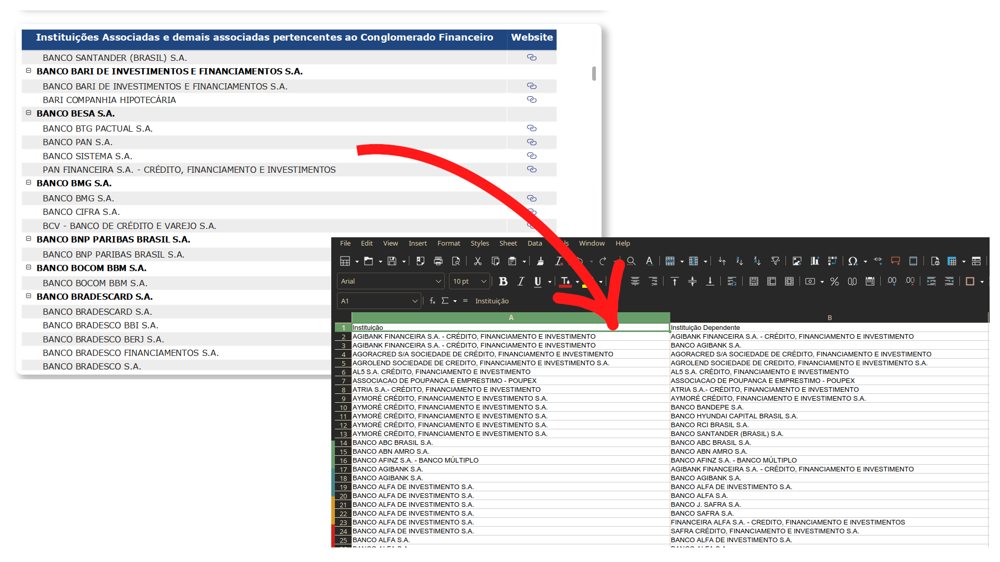
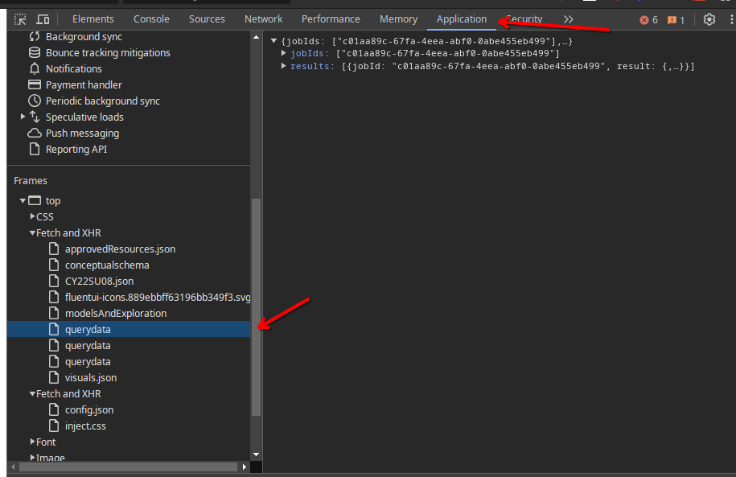
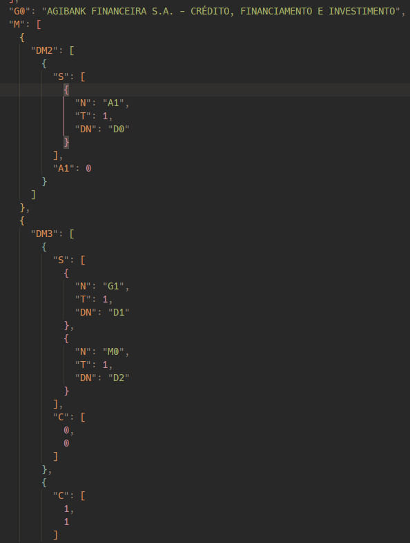

# PowerBi view scrapping

Na page [https://www.fgc.org.br/associadas/instituicoes-associadas-e-conglomerados-financeiros](https://www.fgc.org.br/associadas/instituicoes-associadas-e-conglomerados-financeiros) temos um iframe embutido com uma view do PowerBi que não permite exportar os dados diretamente.



# Script

Clone o projeto e:

```console
$ chmod +x powerbi.py
$ ./powerbi.py input.json out.csv
```

# Algoritmo

Então para extrair foi feito os seguinte:

1. Extrair o link do iframe diretamente: [https://app.powerbi.com/view?r=eyJrIjoiMTIwMjVlZjItNjNkNS00MTI4LTkwN2MtY2E4NWVhMjU5YjUyIiwidCI6ImEzODg4MGE0LWI3MjktNGM0Yy04ZmFmLTk1Yjc1ZDY3ZGU4ZSJ9](https://app.powerbi.com/view?r=eyJrIjoiMTIwMjVlZjItNjNkNS00MTI4LTkwN2MtY2E4NWVhMjU5YjUyIiwidCI6ImEzODg4MGE0LWI3MjktNGM0Yy04ZmFmLTk1Yjc1ZDY3ZGU4ZSJ9)
2. Então abre-se a página e se expande todo o conteúdo: 
3. Na aba Application vemos as requisições fetch feitas: 
4. Cada uma delas contém os dados da tabela PowerBi dentro. Os dados são organizados +- assim:
   1. Dentro do JsonPath (código python) `json.["results"][0]["result"]["data"]["dsr"]["DS"][0]["PH"]` temos nossas data matrices, cada uma contém os dados de uma célula e suas referências.
   2. Dentro de cada data matrix há um `G0` com o valor da célula e um `M` que contém valores de referência, esses são os sub valores expandidos anteriormente.
   3. Dentro de `M` temos `n` matrizes, cada uma com `n` referências, e cada referência tem um possível `S` e um `C`.
   4. `S` indica que a partir daquele pontos e leitura do arquivos vamos usar uma tabela de referência diferente. A ideia é que haja tabelas de referência em: `json["results"][0]["result"]["data"]["dsr"]["DS"][0]["PH"]["dsr"]["DS"][0].get("ValueDicts", {})`, cada uma tem o nome definido em `S.DN` e nós usamos apenas se `S.N == "G1"`, depois essas tabela pode ser indexada numericamente com o valor de `C[0]` se o mesmo for um número. 
5. Depois de ler os campos podemos criar uma lista de pares com a empresa normal e a sua subempresa para poder escrever em um arquivo csv